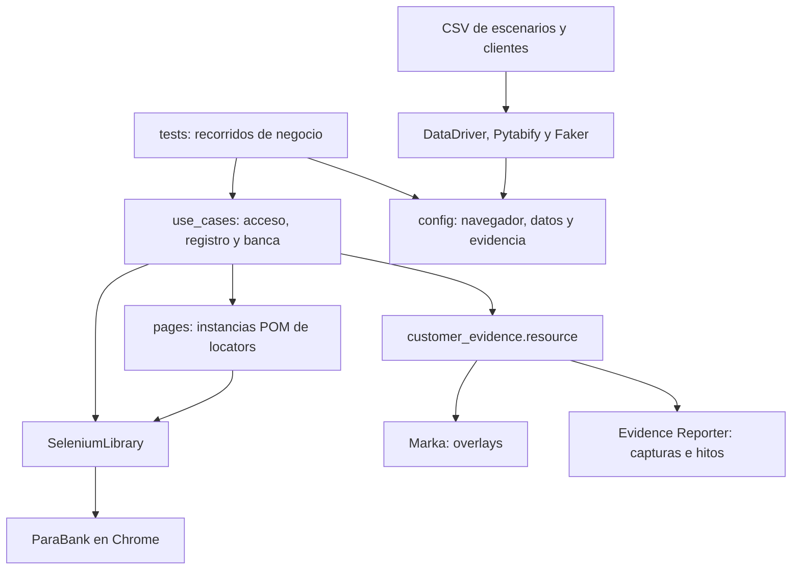
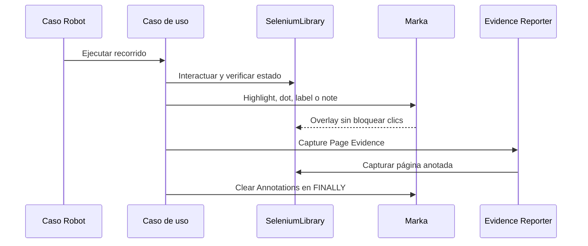
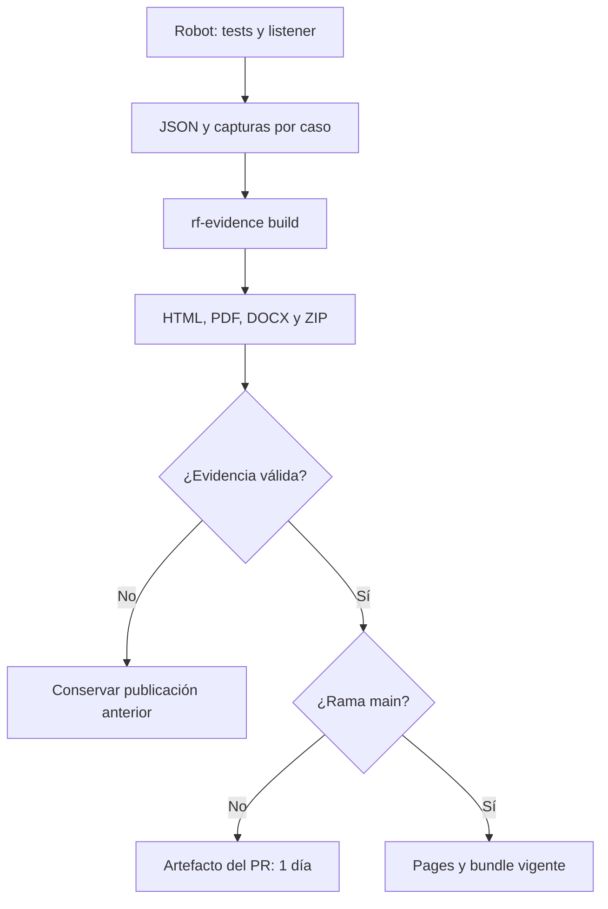

# Arquitectura del ejemplo de Selenium

Los tests expresan recorridos completos de negocio. Los casos de uso contienen las interacciones y verificaciones; los módulos de páginas declaran los locators. SeleniumLibrary controla el navegador existente, Marka lo anota y Evidence Reporter recoge evidencias.

## Capas y dependencias

| Ruta | Responsabilidad |
| --- | --- |
| `tests/` | Registro y consulta, accesos rechazados, apertura de ahorro y transferencia. |
| `use_cases/customer_registration.resource` | Completar alta y comprobar confirmación y acceso. |
| `use_cases/customer_access.resource` | Iniciar/cerrar sesión y comprobar identidad o rechazo. |
| `use_cases/customer_banking.resource` | Apertura y transferencia con comprobación exacta de saldos y movimientos. |
| `pages/*.py` | Instancias de páginas con locators declarativos. No alojan el flujo de negocio. |
| `config/browser.resource` | Abrir/cerrar el navegador y configurar ejecución headless. |
| `config/test_data.resource`, `data/` | Elegir filas por índice y generar usuarios ficticios únicos. |
| `use_cases/customer_evidence.resource` | Capturar resultados y añadir anotaciones sin duplicar el flujo del test. |
| `config/evidence.resource` | Importar y configurar las librerías de evidencia. |

## Datos y aislamiento

DataDriver crea los casos desde los CSV de escenarios. El índice selecciona la fila del archivo de clientes o accesos con Pytabify. Faker genera un usuario único para el registro; la modificación se hace sobre los datos de la ejecución, sin reescribir el CSV fuente.

Los ocho casos pueden ejecutarse de manera independiente. El servicio ParaBank es compartido y externo: un HTTP 500 o un cambio de datos del demo puede afectar la ejecución. Los tests registran el resultado real y no eliminan assertions para ocultar esos fallos.

## Captura de una evidencia anotada

La captura de página incluye puntos y notas externos al elemento. Un recorte de elemento puede dejarlos fuera. La limpieza explícita y el teardown evitan que una anotación aparezca en otra evidencia. Una captura fallida produce un warning por defecto; el resultado de negocio lo determinan las assertions.

## Generación y publicación

El workflow E2E genera evidencia incluso cuando Robot falla y publica el estado real. Pages y ZIP duran hasta reemplazarse; el artefacto de main caduca a los siete días. La limpieza borra bundles anteriores del mismo workflow después de publicar el nuevo. Quality valida Robocop, formato y dry run; el E2E en Chrome comprueba las interacciones reales.

Usa un directorio nuevo por ejecución: `rf-evidence build` incluye los JSON encontrados en su entrada. Consulta [las validaciones registradas](validation.md) y el [README](../README.md) para comandos de instalación y ejecución.
